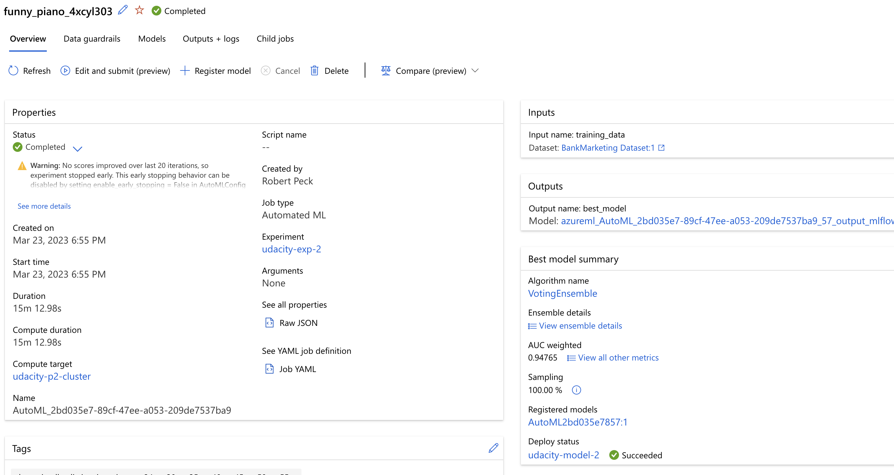

# ML Ops project 2

## Section 1 - Project Overview

The purpose of this project is to demonstrate the capabilities of Azure ML Ops thorugh the following exercises:

* Creating and deploying a model utilzing AutoML
* Consuming REST API endpoints
* Pipeline automation for re/training the bank marketing model

Through these capabilities we learn how to apply DevOps principles to Machine Learning projects. Many of the same principles including automation, troubleshooting, and code management are similar in MLOps as traditional DevOps.

This project specifically works with the Bank Marketing dataset for purposes of training a model, selecting the best one, deploying it as a REST API endpoint, consuming the API, and automating the flow through pipeline automation.

## Section 2 - Architectural Diagram

The following diagram is adapted from the Azure Reference Architecture, [ML Ops for Python](https://learn.microsoft.com/en-us/azure/architecture/reference-architectures/ai/mlops-python). It has been simplified for purposes of illustrating the following key points (labeled on the diagram):

1. MLOps Engineer creating the pipeline build
2. REST Endpoint consumer
3. MLOps Pipeline trigger for retraining

## Section 3 - Future work to improve project

Areas to investigate / improve upon in future work:

* Model performance
  * Apply data science techniques to the data set for additional feature engineering
  * Investigate whether there are additional datasets which could be combined with this marketing data to provide additional parameters to the models
  * Try utilizing different metric scores for model performance
* Pipeline capabilities
  * Automate more of the process including the create of the dataset, monitoring of any data drift, health checks on the endpoint and other monitoring abilities
  * Assuming this endpoing is part of a larger project/platform, integrate the MLOps steps into the build pipeline for the encompassing project (integrate the DevOps and MLOps)

## Section 4 - Screenshots of main steps in project

The following sections contain the required screenshots as requested by the project syllabus.

### Setup security

`az extension add -n azure-cli-ml`
`az ad sp create-for-rbac --sdk-auth --name ml-auth`

Since I am using an account my company manages, I am also not allowed to create a service principal. See following screenshot.

### Show the dataset as available

### Show the expirement completed

### Show the best model

Model rank among the others tried.

Model specific metrics.

### Show application insights enabled

### Show the logs output

### Show the Swagger docs

### Results of invoking endpoint

### Optional -- benchmark results

### Pipeline created

### Pipeline endpoint

### Bank data AutoML

### Published Pipeline overview - Active endpoint

### Run Details Widget

### ML Studio scheduled run

## Section 5 - Screencast of working ML application

*insert link here*
